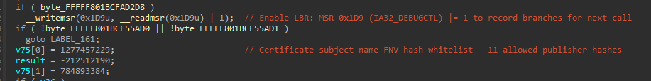
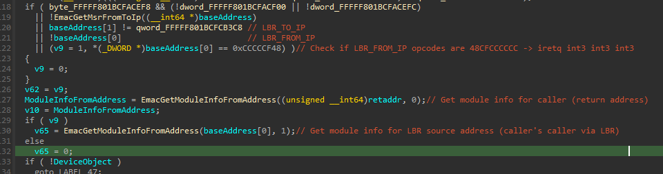

# EMAC Anti-Cheat Driver Analysis

**Target:** EMAC-Driver-x64.sys  
**Platform:** Windows x64 Kernel Mode  
**Game:** Counter-Strike 2 (CS2) — GamersClub  
**TimeDateStamp:** 0x67CAFFCE (Friday, 7 March 2025 14:16:46 GMT)  
**Protector:** VMProtect 3.8+ (virtualization only — no packing due to WHQL requirements)  
**Total Functions:** 931 (145 named with `Emac` prefix)  
**Analysis Date:** March 2026

---

## Table of Contents

1. [Overview](#overview)
2. [Obfuscation Techniques](#obfuscation-techniques)
3. [Initialization & Global Resolution](#initialization--global-resolution)
4. [Anti-Hypervisor Detection](#anti-hypervisor-detection)
5. [InfinityHook & Syscall Interception](#infinityhook--syscall-interception)
6. [Inline Hooks (Test-Signing Mode)](#inline-hooks-test-signing-mode)
7. [Image Load Callback & DLL Injection](#image-load-callback--dll-injection)
8. [Minifilter & File Verification](#minifilter--file-verification)
9. [Kernel Callbacks & Handle Protection](#kernel-callbacks--handle-protection)
10. [Syscall Integrity Monitoring](#syscall-integrity-monitoring)
11. [Driver Self-Integrity Checks](#driver-self-integrity-checks)
12. [Kernel Thread Stack Trace Verification](#kernel-thread-stack-trace-verification)
13. [NMI-Based Stack Scanning](#nmi-based-stack-scanning)
14. [Driver & Module Blacklisting](#driver--module-blacklisting)
15. [Physical Memory & Page Table Walking](#physical-memory--page-table-walking)
16. [BigPool Scanning](#bigpool-scanning)
17. [Last Branch Recording](#last-branch-recording)
18. [Usermode Memory Scanning & Cheat Detection](#usermode-memory-scanning--cheat-detection)
19. [System Table Integrity Checks](#system-table-integrity-checks)
20. [Hardware Fingerprinting (TPM, SecureBoot, PCI)](#hardware-fingerprinting-tpm-secureboot-pci)
21. [Anti-Debug Techniques](#anti-debug-techniques)
22. [IOCTL Communication Architecture](#ioctl-communication-architecture)
23. [Global Variables Reference](#global-variables-reference)
24. [Appendix: Hash Algorithm](#appendix-hash-algorithm)
25. [XOR-Encrypted Strings Index](#xor-encrypted-strings-index)
26. [Complete Function Reference](#complete-function-reference)

---

## Overview

EMAC (EMACLab/GamersClub) is a kernel-mode anti-cheat driver deployed for Counter-Strike 2 on the GamersClub platform. It employs multiple layers of detection and protection including syscall interception via InfinityHook, physical memory scanning, kernel thread stack trace analysis, file signature verification, hardware fingerprinting, and extensive code integrity monitoring.

### Protector Notes

Microsoft WHQL (Windows Hardware Compatibility Lab) stopped signing drivers that use import/memory/resource protection or are packed. Therefore EMAC can only use VMProtect's **virtualization** capabilities — the PE is not packed, and the import table is custom (not protected by VMProtect). Critical dispatch functions, callbacks, and the NMI handler are virtualized to hinder static reverse engineering.

### Key Characteristics

| Property | Value |
|----------|-------|
| XOR IAT Key | `qword_FFFFF801BCFACC40` |
| XOR Opaque Predicate | `qword_FFFFF801BCFACC38` (always true, generates dead code) |
| FNV-1a Hash Seed | 213573 |
| FNV-1a Multiplier | 2438133 |
| Pool Tag | `EMAC` / `CAME` (0x43414D45) |
| Disassembly Engine | [bitdefender/bddisasm](https://github.com/bitdefender/bddisasm) |
| String Obfuscation | [JustasMasiulis/xorstr](https://github.com/JustasMasiulis/xorstr) (3 key pairs) |
| IOCTL Code | 0x1996E494 |
| IOCTL Min Output Buffer | 0x180C (6156 bytes) |
| Minifilter Altitude | 363570 (FSFilter Activity Monitor) |
| InfinityHook Marker Start | 0xEAADDEEAADDEADDE |
| InfinityHook Marker End | 0xAEADDEEADAEAADDE |
| Game Process Hashes | csgo.exe=0x3105807B, cs2.exe=0x29B90D41 |

---

## Obfuscation Techniques

### XOR-Obfuscated Import Address Table (IAT)

All kernel API calls are resolved through a custom XOR-obfuscated import table. The standard PE import table only contains a minimal set of imports (visible in the file headers); the real imports are resolved at runtime in `InitializeImportTable` and stored as XOR-encrypted pointers in global variables.

**The XOR IAT scheme:**

```c
// Resolution pattern used at every call site:
RealFunction = (FunctionType)((StoredPointer ^ qword_FFFFF801BCFACC40) 
               & -(int64)((StoredPointer ^ qword_FFFFF801BCFACC40) > qword_FFFFF801BCFACC38));
```

**Key insight:** `qword_FFFFF801BCFACC38` is an **opaque predicate** — the condition `> qword_FFFFF801BCFACC38` is always true at runtime. It generates dead code paths to confuse static analysis, but only `qword_FFFFF801BCFACC40` (the XOR key) actually matters:

- **Decode:** `<real_address> = <stored_pointer> ^ qword_FFFFF801BCFACC40`
- **Encode:** `<stored_pointer> = <new_address> ^ qword_FFFFF801BCFACC40`

This means an attacker who knows the XOR key can trivially hook any IAT entry by XOR-encoding a new address and writing it to the global. There is no real cryptographic protection — only obfuscation through obscurity.

**Function:** `EmacFindExportByName` (0xBCEFFE34) — Walks PE export table to resolve API addresses, then XORs the result with `qword_FFFFF801BCFACC40` before storing.

**Function:** `InitializeImportTable` — Resolves all imports at driver load. This function allocates **13,664 bytes** of kernel stack space, which is dangerous since the kernel-mode stack is limited to ~12,288 bytes (3 pages). This is caused by junk code from the XOR obfuscation and jm-xorstr library — a potential stack overflow vulnerability.

### XOR-Encrypted String Storage (jm-xorstr)

Strings are obfuscated using [JustasMasiulis/xorstr](https://github.com/JustasMasiulis/xorstr), which encrypts string literals at compile-time and decrypts them at runtime using SSE instructions (`_mm_xor_ps`, `_mm_load_si128`). Three XOR key pairs are used throughout the driver:

| Key Pair | Low QWORD | High QWORD |
|----------|-----------|------------|
| Key 1 | 0x3C5A8F9432649D | 0x3AD429636D08206 |
| Key 2 | 0x4526EB856E5427CF | 0x3C2843EC1513C2B8 |
| Key 3 | 0x23A060BBC844B001 | 0x2EA61242BCCB2B6A |

```c
// Example: Decrypting "MmCopyMemory"
*(_QWORD *)routineName = 0x995FA5C9CE094128;       // Encrypted
*(_QWORD *)&routineName[8] = 0x3E7BCF00E6F3140B;   // Encrypted
v42.m128_u64[0] = 0xFC12DCB9A14A2C65;              // XOR key low
v42.m128_u64[1] = 0x3E7BCF009F817B66;              // XOR key high  
*(__m128 *)routineName = _mm_xor_ps(load(routineName), v42);  // → "MmCopyMemory"
```

---

## Initialization & Global Resolution

### Module & Symbol Resolution

At initialization, the driver resolves a large set of kernel symbols, tables, and offsets stored as global variables. Resolution methods include:

1. **Export lookup** — `EmacFindExportByName` walks `PsLoadedModuleList` and parses PE export tables
2. **Pattern scanning** — `EmacFindFunctionByPattern` / `EmacResolveKernelTableByPattern` scans for byte patterns in kernel modules
3. **Disassembly-based resolution** — Uses [bitdefender/bddisasm](https://github.com/bitdefender/bddisasm) (`NdDecodeEx`) to analyze function prologues and extract dynamic offsets from instructions

**Key resolved globals include:**

| Function | What it resolves |
|----------|-----------------|
| `EmacInitializeSyscallTables` (0xBCF0DD64) | ntoskrnl SSDT and win32k shadow SSDT base addresses |
| `EmacGetNtWow64SyscallTable` (0xBCF0DD80) | WOW64 syscall translation table |
| `EmacGetWin32kSyscallTable` (0xBCF0E378) | Win32k SSDT for GUI syscalls |
| `EmacResolveProcessNotifyTable` (0xBCF11D2C) | PspCreateProcessNotifyRoutine array |
| `EmacResolveThreadNotifyTable` (0xBCF11A5C) | PspCreateThreadNotifyRoutine array |
| `EmacCaptureKernelDebuggerBlock` (0xBCF12AC4) | Capture kernel debugger block to retrieve some addresses and offsets |
| `EmacResolvePspGetContextThreadInternal` (0xBCF11BCC) | Internal context retrieval function |

### Version-Dependent Offsets

The driver dynamically resolves KTHREAD structure offsets at runtime based on Windows version:

| Function | Resolves |
|----------|----------|
| `EmacGetVersionDependentOffset` (0xBCF0ED10) | Various KTHREAD/EPROCESS offsets by build number |
| `EmacResolveThreadTerminatedOffset` (0xBCF0EF24) | KTHREAD.Terminated offset |
| `EmacGetVersionOffset192or200` (0xBCF10D94) | Offsets that differ between 19H2/20H1+ |
| `GetOffsetKThreadStackLimit` | KTHREAD.StackLimit |
| `GetOffsetKThreadStackBase` | KTHREAD.StackBase |
| `GetOffsetKThreadThreadLock` | KTHREAD.ThreadLock |
| `GetOffsetKThreadKernelStack` | KTHREAD.KernelStack |
| `GetOffsetKThreadState` | KTHREAD.State |

**Dead code note:** The driver contains checks for ancient Windows versions (7, 8, 8.1) that are never used — Steam requires Windows 10+ for CS2 and hasn't supported Windows 7 for years.

---

## Anti-Hypervisor Detection

The anti-hypervisor subsystem employs multiple techniques to detect virtual machines and hypervisors. Most checks focus on exploiting poorly-implemented hypervisors rather than detecting well-configured ones. Running with Microsoft Hyper-V enabled on KVM/QEMU typically passes all checks; well in reality they completely ignore all checks if Microsoft Hyper-V is running regardless.

### Functions

| Function | Address | Description |
|----------|---------|-------------|
| `EmacAntiHypervisorChecks` | 0xBCF13B34 | Main orchestrator dispatching all HV checks |
| `EmacAntiHypervisorCheckName` | 0xBCF13A00 | CPUID leaf 0x40000000 hypervisor brand string check |
| `EmacAntiHypervisorLBR` | 0xBCF13A90 | Last Branch Recording MSR validation |
| `EmacAntiHypervisorTrashMsr` | 0xBCF13C28 | Synthetic MSR probe (0x40000000 range) |
| `EmacAntiHypervisorAdditionalChecks` | 0xBCF13C5C | KiErrata checks on kernel globals |
| `EmacAntiHypervisorXsetbv` | 0xBCF13D4C | XSETBV instruction probing |
| `EmacAntiHypervisorTiming` | 0xBCF1837C | RDTSC timing around CPUID |
| `EmacHypervisorCheck` | 0xBCF16CA4 | VMX extension detection |
| `EmacHypervisorCheck_0` | 0xBCF16E10 | SEH-based VMM probes |
| `EmacAntiHypervisorCallVmfunc` | 0xBCEEB1DD | VMFUNC instruction test |
| `EmacDetectVirtualizationPci` | 0xBCF2FBA0 | PCI vendor ID enumeration |
|

### LBR (Last Branch Recording)

Enables Last Branch Recording in IA32_DEBUGCTL (MSR 0x1D9 bit 0), then executes CPUID which causes unconditional VM exit. If LBR bit is cleared after CPUID, VMM is not properly saving/restoring LBR state.

```c
__writemsr(0x1D9, 1);   // Enable LBR (bit 0)
value = __readmsr(0x1D9);
// Hypervisor that intercepts but mishandles → value differs → detected
```

### CPUID Timing Analysis

Measures VM exit overhead using `RDTSC` around `CPUID`:

```c
start = __rdtsc();
__cpuid(regs, 0);
end = __rdtsc();
// Real hardware: ~200 cycles | Virtualized: ~2000+ cycles
```

### Synthetic MSR Probes

Probes VMM-reserved MSR range (0x40000000–0x400000FF). Real hardware generates `#GP`; VMMs may respond with values:

```c
__try {
    value = __readmsr(0x40000000);
    // If no exception → VMM present
} __except {
    // Expected on real hardware
}
```

### CPUID Hypervisor Brand Check

Reads CPUID leaf 0x40000000 to check if the reported hypervisor is **Microsoft Hyper-V** (`"Microsoft Hv"`). Legitimate Hyper-V presence is expected on modern Windows; other brand strings may indicate third-party hypervisors.

### Intel CPU Feature Checks

Before performing Intel-specific checks, the driver:
1. Verifies CPUID processor name contains "Intel"
2. Checks if VMX extensions are enabled (CR4.VMXE)
3. Uses SEH-wrapped `VMCALL`/`VMFUNC` to probe for hypervisor presence

### KiErrata Kernel Variable Checks

Checks three kernel errata flags that may indicate system-level patches inconsistent with virtualization:
- `KiErrata1337Present`
- `KiErrataSkx55Present`  
- `KiErrata704Present`

### PCI Device Enumeration

**Function:** `EmacDetectVirtualizationPci` (0xBCF2FBA0) — Scans PCI configuration space for known virtual hardware vendor IDs:

| Vendor ID | Platform |
|-----------|----------|
| 0x15AD | VMware |
| 0x1AB8 | Parallels |
| 0x1414 | Hyper-V |
| 0x1AF4 | VirtIO (QEMU/KVM) |
| 0x80EE | VirtualBox |

Returns vendor ID and device count. The decompiled logic scans for VMware (0x15AD) first, then VirtualBox (0x80EE).

### PCI Timing Analysis

**Function:** `EmacGetPciLatency` — Measures I/O port access latency for PCI config space reads (ports 0xCF8/0xCFC). TSC is measured around each PCI read at raised IRQL. Potentially used to detect DMA/PCIe-based cheating devices by analyzing access timing anomalies.

### PCI Infrastructure Functions

| Function | Address | Purpose |
|----------|---------|---------|
| `EmacEnumeratePciBridgeSubBus` | — | Traverses PCI bridge secondary buses |
| `EmacBuildPciDeviceRecord` | — | Creates device info record from PCI config |
| `EmacScanPciBusByVendorId` | — | Searches specific bus for target vendor |
| `EmacEnumerateAllPciDevices` | — | Full PCI bus enumeration |
| `EmacEnumeratePciBusDevices` | — | Per-bus device scan |
| `EmacReadPciConfigSpace` | — | Raw PCI config space read via I/O ports |
| `EmacIsAddressWithinPciRange` | — | Address range validation |

### FNV-1a Whitelist for Storage Devices

Legitimate storage device identifiers are whitelisted via FNV-1a hashes to avoid false positives on real hardware:

```c
0x5F29C8DC, 0x3B5D28B5, 0x63C3F8B6, 0x6E4F0C16,
0x21CD3EBC, 0x79B1C26D, 0x64FCF14B, ...
```

---

## InfinityHook & Syscall Interception

EMAC uses [InfinityHook](https://github.com/everdox/InfinityHook) to intercept syscalls without directly patching the SSDT (which would trigger PatchGuard/KPP). This is a rare technique among anti-cheats — typically only seen in some Chinese anti-cheats. The primary motivation is **not just detection** — EMAC needs to fix holes left by Windows and Steam's handle system (e.g., Steam launcher requires handles to the game process, which would otherwise be exploitable).

### How InfinityHook Works

InfinityHook abuses ETW (Event Tracing for Windows) infrastructure. The `HalpCollectPmcCounters` function is called during syscall dispatch and leaves a predictable stack layout with magic marker values. EMAC scans the stack for these markers and replaces the syscall function pointer.

### Initialization

**Function:** `EmacInitializeInfinityHook` (0xBCF4C2B4) — Calls `HalpCollectPmcCounters`, then scans the resulting stack for:
- Opcode `0x135` → dispatches to `EmacCheckStackIntegrity`
- Opcode `0xF33` → dispatches to `EmacInfinityHookSetup`

**Function:** `EmacGetCpuClock` (0xBCF4C150) — The core InfinityHook callback. Called during syscall dispatch:

1. Gets current thread ID via `KeGetCurrentThread()`
2. Iterates `g_EmacInfinityHookList` — an array of 24-byte entries: `{unused, threadId, replacementAddr, originalAddr}`
3. Calls `IoGetStackLimits` to get stack boundaries
4. Scans stack for opcode `0xF33` followed by `0x501802` or `0x601802`
5. Then scans for magic markers in range `[0xEAADDEEAADDEADDE, 0xAEADDEEADAEAADDE)`
6. At offset +9 QWORDs from the marker, finds the syscall function pointer
7. If it matches `originalAddr`, replaces it with `replacementAddr`

### Magic Markers

```c
#define INFINITY_HOOK_MARKER_START  0xEAADDEEAADDEADDE
#define INFINITY_HOOK_MARKER_END    0xAEADDEEADAEAADDE
// Syscall pointer at marker + 9 QWORDs
```

### InfinityHook Infrastructure Functions

| Function | Address | Purpose |
|----------|---------|---------|
| `EmacInfinityHookSetup` | 0xBCF4A794 | Registers syscall interceptions into the hook list |
| `EmacInfinityHookHandler` | 0xBCF4A8F0 | Stack scanner that performs the actual pointer replacement |
| `EmacCheckStackIntegrity` | 0xBCF4A3B0 | Validates stack integrity during dispatch |
| `EmacGetCpuClock` | 0xBCF4C150 | Main callback invoked by HAL PMC collection |
| `EmacInitializeInfinityHook` | 0xBCF4C2B4 | Initialization — hooks HalpCollectPmcCounters |

### Virtualized Dispatcher

All 14 syscall handlers call a **VMProtect-virtualized** function (`sub_FFFFF801BCF4A358`) to resolve the original syscall procedure. This means the actual dispatch logic cannot be fully reversed statically — it transitions into a VM enter.

### Intercepted Syscalls (14 Total)

| Syscall | Handler Function | Behavior |
|---------|-----------------|----------|
| **NtCreateThreadEx** | `EmacNtCreateThreadExHandler` | Checks if target is game process. Verifies StartRoutine against `DbgBreakPoint`, `DbgUiRemoteBreakin`, `DbgUserBreakPoint`. Sets flag for report. |
| **NtCreateThread** | `EmacNtCreateThreadHandler` | Same checks as NtCreateThreadEx. |
| **NtQueueApcThread** | `EmacNtQueueApcThreadHandler` | Checks if target is game process. Verifies APC routine against debug break functions AND `LoadLibraryA/W/ExA/ExW`, `LdrLoadDll`. Reports code injection attempts. |
| **NtQueueApcThreadEx** | `EmacNtQueueApcThreadExHandler` | Same as NtQueueApcThread. |
| **NtSetContextThread** | `EmacNtSetContextThreadHandler` | Checks if target is game process. Examines `Context->Rip` for suspicious values. |
| **NtAllocateVirtualMemory** | `EmacNtAllocateVirtualMemoryHandler` | Whitelists `x86launcher.exe` and `x64launcher.exe` (Steam). Blocks and reports other callers allocating in game process. **This is a Steam handle fix.** |
| **NtFreeVirtualMemory** | `EmacNtFreeVirtualMemoryHandler` | Fixes edge cases for Steam launcher and csrss. No reports generated. |
| **NtProtectVirtualMemory** | `EmacNtProtectVirtualMemoryHandler` | Fixes edge cases for Steam launcher and csrss. No reports generated. |
| **NtWriteVirtualMemory** | `EmacNtWriteVirtualMemoryHandler` | Reports if current process is NOT Steam or csrss AND target is game process. |
| **NtReadVirtualMemory** | `EmacNtReadVirtualMemoryHandler` | Reports if any non-game process reads within game's region size or `engine2.dll` region. |
| **NtMapViewOfSection** | `EmacNtMapViewOfSectionHandler` | Fixes edge cases for Steam/csrss. No reports. |
| **NtUnmapViewOfSection** | `EmacNtUnmapViewOfSectionHandler` | Fixes edge cases for Steam/csrss. No reports. |
| **NtUserFindWindowEx** | `EmacNtUserFindWindowExHandler` | Reports if non-Steam/non-game/non-EMAC process queries for window name containing `L"Counter-"`. |
| **NtUserSendInput** | `EmacNtUserSendInputHandler` | **Blocks ALL simulated input** from any process and generates a report. |

### Report Functions

Each handler has a corresponding report function that logs the event for later retrieval:

| Report Function | Tracks |
|----------------|--------|
| `EmacReportNtCreateThread` | Thread creation in game |
| `EmacReportNtCreateThreadEx` | Extended thread creation |
| `EmacReportCreateThread` | Generic thread creation |
| `EmacReportNtQueueApcThreadEx` | APC injection attempts |
| `EmacReportNtReadVirtualMemory` | Memory reads from game |
| `EmacReportNtUserFindWindowEx` | Window enumeration of game |
| `EmacReportNtSendUserInput` | Simulated input blocking |
| `EmacNtWriteVirtualMemoryReport` | Memory writes to game |
| `EmacReportNtAllocateVirtualMemory` | Memory allocation in game |

---

## Inline Hooks (Test-Signing Mode)

### Condition Check

**Function:** `EmacCanHookSystem` (0xBCF2xxxx) — Queries `ZwQuerySystemInformation` with class **103** (`SystemCodeIntegrityInformation`):

```c
bool EmacCanHookSystem() {
    ZwQuerySystemInformation(103, &v2, 8, &retLength);  // SystemCodeIntegrityInformation
    return (status < 0) || (v2 & 0x140000000000) != 0;  // Test-signing ON + No integrity checks
}
```

If the system has **test-signing enabled** AND **integrity checks disabled** (`v2 & 0x140000000000`), the driver installs inline hooks on 6 kernel functions. 

**Note:** In practice, the game refuses to launch with test-signing enabled, so these hooks may only activate in specific development/testing scenarios.

### Hooked Functions

| Function | Hook Handler | Purpose |
|----------|-------------|---------|
| `KeAttachProcess` | `EmacKeAttachProcessHook` | Monitor/block process context switching |
| `KeStackAttachProcess` | `EmacKeStackAttachProcessHook` | Monitor/block stack-based process attach |
| `MmCopyVirtualMemory` | `EmacMmCopyVirtualMemoryHook` | Intercept cross-process memory copies |
| `RtlFindExportedRoutineByName` | `EmacRtlFindExportedRoutineByNameHook` | Redirect export resolution to EMAC hooks |
| `KeIsAttachedProcess` | `EmacKeIsAttachedProcessHook` | Monitor attach status queries |
| `MmGetSystemRoutineAddress` | `EmacMmGetSystemRoutineAddressHook` | Redirect routine resolution to EMAC hooks |

The hooks on `RtlFindExportedRoutineByName` and `MmGetSystemRoutineAddress` are particularly interesting: they ensure that any **newly loaded driver** will resolve functions through EMAC's hooks, effectively extending protection to drivers loaded after EMAC.

### Hook Infrastructure

| Function | Address | Purpose |
|----------|---------|---------|
| `EmacInstallHooks` | 0xBCF27788 (0xEDF bytes) | Master hook installation — resolves targets, writes inline patches |
| `EmacUninstallHooks` | — | Removes all inline hooks (cleanup) |
| `EmacRestoreHookedPointers` | — | Restores original function bytes |
| `EmacVerifyRoutineAddress` | — | Validates hook target is in expected module |
| `EmacPhysicalExchangePointer` | — | Atomic pointer exchange via physical memory mapping |

---

## Image Load Callback & DLL Injection

### Function: `EmacImageCallback` (0xBCEF09D4, 0x1A79 bytes — massive)

Registered via `PsSetLoadImageNotifyRoutineEx`. This is one of the largest non-virtualized functions in the driver and performs multiple actions on every image load:

#### Actions Performed

1. **Module tracking** — Inserts every loaded module into an internal list via `EmacCreateModuleEntry` (0xBCEF719C)
2. **ntdll.dll export resolution** — Resolves: `DbgBreakPoint`, `DbgUiRemoteBreakin`, `DbgUserBreakPoint`, `LdrLoadDll`
3. **kernel32.dll export resolution** — Resolves: `LoadLibraryA`, `LoadLibraryW`, `LoadLibraryExA`, `LoadLibraryExW`
4. **kernelbase.dll export resolution** — Same LoadLibrary variants (for WOW64 processes)
5. **Game module tracking** — Records `cs2.exe` base/size and `engine2.dll` base/size
6. **GamersClub launcher tracking** — Records launcher image base
7. **EMAC DLL injection** — Loads the appropriate EMAC client DLL into the game process

#### DLL Injection Mechanism

The driver injects its client DLL into the game process from kernel mode using:

```c
// Create remote thread in game process targeting LoadLibraryW
NtCreateThreadEx(&hThread, ..., gameProcess, KERNEL32!LoadLibraryW, dllPath, ...);
```

#### Injected DLL Paths

| DLL Pattern | Target |
|-------------|--------|
| `\EMAC-CSGO-x64.dll` | CS2 64-bit game process |
| `\EMAC-CSGO-x86.dll` | CS:GO 32-bit game process (legacy) |
| `\EMAC-CS-Client-x64.dll` | Fallback CS2 64-bit |
| `\EMAC-CS-Client-x86.dll` | Fallback CS:GO 32-bit |
| `\EMAC-Client-x64.dll` | Non-game 64-bit process |
| `\EMAC-Client-x86.dll` | Non-game 32-bit (WOW64) process |

#### Resolved Module Patterns

| XOR-Decrypted String | Purpose |
|---------------------|---------|
| `ntdll.dll` | System DLL base tracking |
| `kernel32.dll` | LoadLibrary export resolution |
| `kernelbase.dll` | WOW64 LoadLibrary resolution |
| `user32.dll` | WOW64 support tracking |
| `\emac\` | EMAC client DLL detection |
| `\csgo\bin` | CS2 game module tracking |
| `\game\bin\win64\` | CS2 engine directory |
| `engine2.dll` | Source 2 engine module |

### Related Functions

| Function | Address | Purpose |
|----------|---------|---------|
| `EmacCreateModuleEntry` | 0xBCEF719C | Creates internal module tracking entry |
| `EmacVerifyModuleWorkItem` | 0xBCEF7338 | Queues module verification as work item |
| `EmacVerifyModuleEntry` | 0xBCF20390 (0x738E — massive) | Full module verification (VMProtect-heavy) |
| `EmacVerifyLoadedModulesList` | 0xBCEF761C | Iterates PsLoadedModuleList for validation |
| `EmacGetModuleInfoFromAddress` | 0xBCEF74F0 | Looks up module info from internal list by address |
| `EmacCreateUserThread` | — | Creates remote threads in user processes |
| `EmacApcCleanupRoutine` | 0xBCF1578C | Cleans up after APC-based injection |

---

## Minifilter & File Verification

### FSFilter Registration

EMAC registers a minifilter with altitude **363570** (FSFilter Activity Monitor category). A pre-operation callback intercepts memory section creation (image loading) to validate files before they're mapped.

### Filter Callback Flow

**Function:** `EmacFltCallback` (0xBCEF27A4) — Pre-operation callback:

1. Checks if operation is `IRP_MJ_ACQUIRE_FOR_SECTION_SYNCHRONIZATION` with `SectionPageProtection = PAGE_EXECUTE (0x10)`
2. Only processes section creates from PID 4 (System) or the game process
3. Gets file name information via `FltGetFileNameInformation`
4. Calls `EmacFltVerifyFileName` to validate the file
5. If verification fails → blocks the load with `STATUS_INSUFFICIENT_RESOURCES (0xC000009A)`

### File Verification

**Function:** `EmacFltVerifyFileName` (0xBCEF3180) — Multi-stage verification:

1. **Name-based check:** `EmacCheckDbkProcessHackerByFileName` — immediately blocks if filename contains `dbk64`, `dbk34`, or `kprocesshacker`
2. **PE validation:** Reads file into buffer, validates MZ/PE signatures, verifies PE64 format (Magic=0x20B)
3. **Signature check:** `EmacVerifyFileSigned` — Uses CI.dll APIs to validate Authenticode signature
4. **Certificate check:** `EmacVerifyFileCertificateName` — Checks subject name against 14 blacklisted certificate signers

**Note:** The Process Hacker detection here is by file name only — renaming a legitimate driver to `dbk64.sys` would trigger a false positive block.

### Certificate Blacklist (14 entries)

**Function:** `EmacVerifyFileCertificateName` (0xBCEF3404) — Checks PE signature subject name against known malicious signers:

| # | Subject Name | Association |
|---|-------------|-------------|
| 1 | Cheat Engine | Cheat Engine tool |
| 2 | Benjamingine | Cheat Engine variant signer |
| 3 | Wen Jia Delpy | Benjamin Delpy alias (Mimikatz author) |
| 4 | ChongKimLiu | Known cheat certificate signer |
| 5 | NETSHARK Chan | Known cheat certificate signer |
| 6 | FPSCHEAT Sagl | FPS cheat company |
| 7 | PlatinumS | Cheat provider |
| 8 | JRTECH S Digital | Known cheat signer |
| 9 | Handan City District... | Chinese company (cheat front) |
| 10 | Nanjing Information Technology... | Chinese company |
| 11 | Fuqing Yuntao Network Tech | Chinese company |
| 12 | Jeromin Yuntan Network | Company certificate |
| 13 | Niki Sok / Cody Eri | Known cheat signer |
| 14 | Beijing Image Technology Ltd. | Chinese company |

### File I/O and Signing Functions

| Function | Address | Purpose |
|----------|---------|---------|
| `EmacFltReadFileToBuffer` | 0xBCF15DB0 | Reads file contents through minifilter |
| `EmacVerifyFileSigned` | 0xBCF14290 | CI.dll-based Authenticode verification |
| `EmacVerifyFileSignedByFileName` | 0xBCF14940 | Verifies signature by file path |
| `EmacVerifyFilePolicyInfo` | 0xBCF13E04 | Checks file against policy |
| `EmacCalculateAuthenticodeHash` | 0xBCF149F8 | Computes PE Authenticode hash |
| `EmacIsInVerifiedImagesList` | 0xBCF14168 | Checks cached verification results |
| `EmacInitializeVerifiedImagesList` | 0xBCF150F8 | Initializes verification cache |
| `EmacInsertVerifiedImageEntry` | 0xBCF15154 | Adds to verification cache |
| `EmacVerifyFileUnknown` | 0xBCEF4188 | Secondary verification path |
| `EmacFltSendMessageWithTimeout` | 0xBCEF4948 | Sends message to user-mode via Filter Manager |

---

## Kernel Callbacks & Handle Protection

### ObRegisterCallbacks

**Function:** `EmacObPostHandleOperation` (0xBCEF4B98) — Post-operation callback for handle creation/duplication:

```c
OB_CALLBACK_REGISTRATION callbackReg = {
    .OperationRegistration = {
        .ObjectType = PsProcessType,
        .Operations = OB_OPERATION_HANDLE_CREATE | OB_OPERATION_HANDLE_DUPLICATE,
        .PostOperation = EmacObPostHandleOperation
    }
};
```

### Other Kernel Callbacks

- **PsSetLoadImageNotifyRoutineEx** → `EmacImageCallback`
- **PsSetCreateProcessNotifyRoutine** → Virtualized (tracks process creation/termination)
- **PsSetCreateThreadNotifyRoutine** → Virtualized (tracks thread creation)

**Note:** Thread and process callbacks are VMProtect-virtualized and cannot be fully reversed.

### Handle Stripping

**Function:** `EmacStripProcessHandles` (0xBCF2FF74) — Uses `ExEnumHandleTable` to iterate all system handles and strip dangerous access rights from handles to protected processes:

```c
void HandleEnumCallback(HANDLE_TABLE_ENTRY* entry, PVOID context) {
    // XOR lower 25 bits to remove dangerous access rights
    entry->GrantedAccess = (entry->GrantedAccess & 0xFE000000) | 
                           (entry->GrantedAccess ^ stripMask) & 0x01FFFFFF;
}
```

**Access masks stripped:**

| Object Type | Strip Mask | Removed Rights |
|-------------|------------|----------------|
| Process (standard) | 0xFFFFF7C5 | VM_READ, VM_WRITE, VM_OPERATION |
| Process (PPL) | 0xFFFFF7D5 | More permissive for Protected Process Light |
| Thread | 0xFFFFFFED | SUSPEND_RESUME, TERMINATE |

### Handle Management Functions

| Function | Address | Purpose |
|----------|---------|---------|
| `EmacEnumHandleTableWin7` | 0xBCF1615C | Legacy handle table enumeration (dead code) |
| `EmacEnumHandleTable` | 0xBCF16194 | Modern handle table walker |
| `EmacGetProcessHandlesInfo` | 0xBCF1620C | Gets handle info for a process |
| `EmacQuerySystemHandleInformation` | — | ZwQuerySystemInformation wrapper for handles |

---

## Syscall Integrity Monitoring

### Function: `EmacDetectSyscallHooks` (0xBCF2E468)

Monitors critical syscalls for inline hooks by comparing in-memory bytes against a clean copy of ntoskrnl.exe loaded from disk.

### SSDT Resolution

**Function:** `EmacResolveSsdtEntry` (0xBCF0DC90) — Resolves syscall handler address from SSDT:

```c
handlerAddress = SsdtBase + (SsdtTable[syscallIndex] >> 4);
```

**SSDT Table Globals:**
- `qword_FFFFF801BCFADB28` — ntoskrnl SSDT (primary)
- `qword_FFFFF801BCFADB30` — win32k shadow SSDT

### Monitored Syscalls

| Syscall | FNV-1a Hash | Purpose |
|---------|-------------|---------|
| NtOpenProcess | 0x99A68185 | Process handle acquisition |
| NtReadVirtualMemory | 0x8C0AAAED | Memory reading |
| NtWriteVirtualMemory | 0x0B3DE7DF | Memory writing |
| NtProtectVirtualMemory | 0x9903CAA0 | Memory protection changes |
| NtQueryVirtualMemory | 0x7C202192 | Memory information query |
| NtAllocateVirtualMemory | 0x75225970 | Memory allocation |
| NtSuspendThread | 0x5BEF89C9 | Thread suspension |
| NtCreateThreadEx | 0x86DE5B7C | Thread creation |

### Syscall Resolution Functions

| Function | Address | Purpose |
|----------|---------|---------|
| `EmacFindSyscallRoutineByHash` | 0xBCF0DCD4 | Finds syscall handler by FNV-1a hash |
| `EmacFindSyscallIndexByHash` | 0xBCF0DCF0 | Finds syscall index by hash |
| `EmacInitializeSyscallTables` | 0xBCF0DD64 | Caches SSDT base addresses |
| `EmacIsSystemIntegrityVerified` | 0xBCF0DC64 | Global integrity flag check |
| `EmacVerifySyscallIntegrity` | 0xBCF0EA20 | Full syscall table integrity validation |

---

## Driver Self-Integrity Checks

The driver performs self-integrity verification by comparing its in-memory image against the original file on disk, detecting any runtime patches to its own code.

### Mechanism

1. **File path resolution:** `EmacGetDriverFromRegistry` (0xBCF0D370) — Reads the driver's file path from the Windows registry
2. **File reading:** Reads the driver PE from disk into a kernel buffer
3. **Relocation processing:** Stores the relocation table entries in a list for later fixup
4. **XOR encryption/decryption:** `EmacDecryptDriver` (0xBCF0D6C4) — The on-disk copy is XOR-encrypted with a simple key for storage; `EmacGetDriverDecrypted` (0xBCF0D258) decrypts it into a working copy
5. **Section comparison:** Compares the decrypted disk copy against the live in-memory image section by section

### Integrity Comparison Functions

**Function:** `EmacVerifyDriverIntegrityImportTable` (0xBCF0D790) — Reads decrypted driver copy, iterates PE sections. For each section that is **readable but NOT .idata** (import data), performs a byte-by-byte comparison against `g_DriverBase`. Detects patches to code sections.

**Function:** `EmacVerifyDriverIntegrityReadableSection` (0xBCF0D904) — Similar check focused on sections with characteristics `0x40000000` (readable, non-executable). Compares against the decrypted driver copy.

### Self-Integrity Function List

| Function | Address | Purpose |
|----------|---------|---------|
| `EmacGetDriverFromRegistry` | 0xBCF0D370 | Gets driver file path from registry |
| `EmacLoadAndDecryptDriver` | 0xBCF0D358 | Loads and decrypts driver from disk |
| `EmacDecryptDriver` | 0xBCF0D6C4 | XOR-decrypts the stored driver copy |
| `EmacGetDriverDecrypted` | 0xBCF0D258 | Returns decrypted driver buffer |
| `EmacGetDriverDecrypted_0` | 0xBCF0D1B4 | Alternative decryption entry |
| `EmacFreeDriver` | 0xBCF0D304 | Frees decrypted driver buffer |
| `EmacVerifyDriverIntegrityImportTable` | 0xBCF0D790 | Compares non-.idata sections |
| `EmacVerifyDriverIntegrityReadableSection` | 0xBCF0D904 | Compares readable sections |

---

## Kernel Thread Stack Trace Verification

This is one of the most significant detection mechanisms. It iterates all system threads, captures their kernel stack back traces, and verifies that every return address belongs to a known, signed kernel module. Unsigned code running in kernel threads (e.g., manually-mapped drivers) is detected.

**Huge EasyAntiCheat vibes here**

### Thread Start Address Resolution

**Function:** `EmacGetThreadStartAddress` — Queues a work item (`EmacGetThreadStartAddressWorkItem`) to retrieve the Win32 start address of a thread. The start address is verified to reside within an `ntoskrnl.exe` code section.

**Function:** `EmacGetThreadStartAddressWorkItem` — Executes in a work item context:
1. Walks the work item queue list
2. Checks if the work item's address belongs to a known module
3. Retrieves `Win32StartAddress` via `EmacGetThreadWin32StartAddress`
4. Validates it's within ntoskrnl code sections

### Stack Trace Walker

**Function:** `EmacVerifyKernelThreadsStackTrace` (massive function) — The main integrity scanner:

1. **Thread enumeration:** Iterates thread IDs from 8 to 0x10000 (step 4), looks up each via `PsLookupThreadByThreadId`
2. **Filters:** Skips current thread, non-system threads (`EmacIsSystemThread`)
3. **KTHREAD field access:** Dynamically resolves offsets for `StackLimit`, `StackBase`, `ThreadLock`, `KernelStack`, `State`
4. **Stack capture:** Acquires thread spinlock, checks thread state == 5 (Waiting), copies up to 0x2000 bytes of kernel stack via `memmove`
5. **Stack unwinding:** Uses `RtlLookupFunctionTableEntry` + `RtlVirtualUnwind` to walk the stack frames (up to 32 frames)
6. **Validation per frame:**
   - Checks address is valid via `MmIsAddressValid` and `EmacIsPageEntryValid`
   - Verifies address belongs to a known module via `EmacGetModuleInfoFromAddress`
   - Confirms `RtlPcToFileHeader` result matches module's `ImageBase`
   - Verifies module is signed by **"Microsoft Corporation"** (XOR-encrypted string comparison)
   - Checks module name doesn't contain **"mcupdate"** (Microsoft CPU microcode update — special case)
7. **Reporting:**
   - Mode 0: If a frame has NO module info and NO file header → `EmacReportThreadInvalidStackTrace` (unsigned code detected)
   - Mode 1: If frame is in a module but NOT in a code section → `EmacReportThreadInvalidStackTrace_2` (code in data section)

### Related Thread Functions

| Function | Address | Purpose |
|----------|---------|---------|
| `EmacCaptureStackBackTrace` | — | Captures current thread's stack |
| `EmacGetThreadTeb` | — | Gets Thread Environment Block |
| `EmacIsSystemThread` | — | Checks if thread is system thread |
| `EmacGetThreadContext` | — | Gets thread CPU context |
| `EmacGetWow64ThreadContext` | — | Gets WOW64 thread context |
| `EmacGetThreadStartAddressByOffset` | — | Gets start address via KTHREAD offset |
| `EmacGetThreadWin32StartAddressByOffset` | — | Gets Win32 start address via offset |
| `EmacGetThreadWin32StartAddress` | — | Resolves Win32 start address |
| `EmacVerifyThreadStackBackTrace` | — | Per-thread stack validation |
| `EmacHandleThreadUnknown` | — | Unknown thread processing |
| `EmacReportStackTrace` | — | Generates stack trace report |

---

## NMI-Based Stack Scanning

### Function: `EmacRegisterNmiCallback` (0xBCF37AF4)

Fires Non-Maskable Interrupts to all CPUs to capture kernel stacks at arbitrary points, detecting hidden code that might not be visible during normal thread enumeration.

### NMI Callback

**Function:** `EmacNmiCallback` — **VMProtect-virtualized**. The NMI callback is one of the functions that cannot be reversed — it transitions to a VM enter immediately. Based on the surrounding code patterns, it likely:
1. Captures the interrupted thread's stack
2. Walks return addresses
3. Checks for RWX (read-write-execute) pages
4. Reports unsigned/suspicious code

```c
// Registration
KeRegisterNmiCallback(EmacNmiCallback, context);
// Fires NMI to all processors
KeIpiGenericCall(FireNmiOnAllCpus, context);
```

---

## Driver & Module Blacklisting

### MmUnloadedDrivers Scanner

**Function:** `EmacVerifyMmUnloadedDrivers` (0xBCF2E98C) — Scans `MmUnloadedDrivers` for evidence of previously-loaded cheat tool drivers. Uses XOR-encrypted strings with wildcard matching.

**Blacklisted Drivers (11 entries):**

| # | Pattern | Tool |
|---|---------|------|
| 1 | `blackbonedrv*.sys` | BlackBone memory injection framework |
| 2 | `blackbonedrv10.sys` | BlackBone version 10 |
| 3 | `vbox.sys` | VirtualBox hypervisor driver |
| 4 | `kernel-bridge.sys` | Kernel memory bridge tool |
| 5 | `kprocesshacker.sys` | Process Hacker kernel driver |
| 6 | `windowskernelexplorer.sys` | Windows Kernel Explorer |
| 7 | `apimonitor-drv-x64.sys` | Rohitab API Monitor (64-bit) |
| 8 | `apimonitor-drv-x86.sys` | Rohitab API Monitor (32-bit) |
| 9 | `apimonitor-psn-x64.sys` | API Monitor PSN (64-bit) |
| 10 | `apimonitor-psn-x86.sys` | API Monitor PSN (32-bit) |
| 11 | `dbgview*.sys` | SysInternals DebugView |

### PiDDBCache Scanner

**Function:** `EmacVerifyPiDDBCacheTable` — Scans the PiDDB (Plug and Play Driver Database) cache, which contains records of all drivers the system has attempted to load, including unsigned ones that were blocked.

### PsLoadedModuleList Verification

**Function:** `EmacVerifyLoadedModulesList` (0xBCEF761C) / `EmacVerifySystemImagesPte` — Iterates `PsLoadedModuleList` and verifies:
- PE section PTE flags match expected values from the on-disk PE headers
- Code sections are marked executable but not writable
- Data sections are not executable

### Process Hacker Detection

**Functions:** `EmacCheckDbkProcessHacker` (0xBCEF3E80) / `EmacCheckDbkProcessHackerByFileName` (0xBCEF40B8)

Checks for Process Hacker/Cheat Engine driver names via XOR-decrypted Unicode strings:

| Pattern | Tool |
|---------|------|
| `dbk64` | Process Hacker 64-bit kernel driver |
| `dbk34` | Process Hacker 32-bit kernel driver (WOW64) |
| `kprocesshacker` | Alternative Process Hacker driver name |

**Weakness:** Purely name-based — renaming any driver to `dbk64.sys` triggers detection.

---

## Physical Memory & Page Table Walking

### Page Table Walking Infrastructure

The driver implements full 4-level page table walking (PML4 → PDPT → PD → PT) to validate physical memory and detect RWX/non-paged allocations:

| Function | Purpose |
|----------|---------|
| `EmacGetPML4E` | Gets Page Map Level 4 Entry |
| `EmacGetPDPE` | Gets Page Directory Pointer Entry |
| `EmacGetPDE` | Gets Page Directory Entry |
| `EmacGetPTE` | Gets Page Table Entry |
| `EmacIsPageEntryValid` | Validates PTE (checks Present bit, large page flag) |
| `EmacIsPhysicalPageValid` | Checks if physical page is valid |
| `EmacIsPhysicalPageWritable` | Checks if page is writable |
| `EmacIsPhysicalPageExecutable` | Checks if page is executable (NX bit clear) |
| `EmacIsPhysicalPageNonPaged` | Checks if page is non-paged |
| `EmacIsExecutableMemoryProtection` | Checks memory protection flags |

### Physical Memory Scanning

**Function:** `EmacScanPhysicalMemoryPatterns` / `EmacIpiWalkPageTables`

Walks physical pages looking for:
- Pages that are both **writable AND executable** (RWX) — common for injected code
- Manually mapped drivers that bypass normal module loading
- Suspicious patterns in physical memory regions

| Function | Purpose |
|----------|---------|
| `EmacReadPhysicalMemory` | Reads physical memory via `MmCopyMemory` |
| `EmacReadPhysicalAddress` | Reads from physical address |
| `EmacFreePhysicalMemoryMapping` | Releases physical memory mapping |
| `EmacGetPhysicalPageInfo` | Gets page attributes |
| `EmacInitializePhysicalMemoryMapping` | Sets up physical memory access |
| `EmacCopyPhysicalMemoryAllCores` | IPI-synchronized physical memory copy |
| `EmacIpiCopyPhysicalMemoryAllCoresCallback` | IPI callback for synchronized copy |
| `EmacGetPhysicalMemoryRangesInPages` | Gets valid physical memory ranges |
| `EmacGetPhysicalMemoryObject` | Gets `\Device\PhysicalMemory` section object |
| `EmacValidatePhysicalRange` | Validates physical address range |

### PhysicalMemory Handle Check

**Function:** `EmacVerifyPhysicalMemoryHandles` — Checks if any process has an open handle to `\Device\PhysicalMemory`. Direct physical memory access through this object is a common technique for reading game memory without going through normal virtual memory APIs.

---

## BigPool Scanning

**Function:** `EmacScanBigPool` — Queries `SystemBigPoolInformation` (class 0x42) via `ZwQuerySystemInformation` to enumerate large kernel pool allocations.

### Algorithm

1. First caches the ntoskrnl export table entries (function name → address mapping stored in 312-byte records)
2. Queries BigPool information iteratively (doubles buffer size on `STATUS_INFO_LENGTH_MISMATCH`)
3. For each BigPool entry:
   - Checks allocation size is in range [0x3001, 0x400FFF]
   - Verifies it's a **paged** allocation (bit 0 of address == 0 → skip, == 1 → check)
   - Filters by pool tag: either `'None'` (untagged) or all non-`'CAME'` tags depending on configuration flag
   - Validates page entry and copies allocation via `MmCopyMemory`
4. For each copied allocation:
   - Checks for PE headers (`MZ`/`PE` signatures) → sets PE flags (MZ=1, PE=3, PE64=7)
   - Checks for non-zero data (strings/code → flag 8)
   - **Scans for ntoskrnl import addresses** — starting at offset 0x1000, checks every 8 bytes for pointers within ntoskrnl range, matches against cached export addresses
   - If import count is between 9 and 79 → reports as **suspicious manually-mapped driver**

### Detection Logic

A non-tagged BigPool allocation containing a PE image with 9-79 ntoskrnl imports is flagged as a manually-mapped cheat driver. The pool tag `'CAME'` (EMAC's own tag) is excluded from scanning.

---

## Last Branch Recording

During my analysis i oftenly see that they explicitly enable LBR logging, this came into my attention because i didn't know why in the beggining:

**In classpnp dispatcher hook they are enabling LBR logging right before function return**


**Then on dispatcher beggining they check if to IP and from IP are expected**


### But why? 
Well i had to resort to google and i found an interesting article explaining how LBR can be used to detect ROP chaning:

*Using gadgets, an attacker can call any system function. A single function call is usually not enough, though; it’s necessary to perform something with more logic. However, creating an ROP chain with more complicated logic requires more time and is also limited by available modules as well as activated address space layout randomization (ASLR). That’s why ROP is often used as a method to bypass some protection and then execute malware code. For instance, you can create an ROP chain for allocating memory for shellcode, calling VirtualProtect, and transferring control for this shell code.
Thus, for detecting ROP attacks we can intercept calls to system functions and try to check how the control flow was transferred to this point: by calling an instruction (normal behavior) or fetching a `ret` instruction (abnormal behavior).
But how can we get jump addresses? Modern processors are embedded with a mechanism called Last Branch Recording. When activated, the processor records jump addresses into Model Specific Registers (MSRs). The number of recorded branches (which the CPU has jumped from and to) depends on the type of processor.* [See more](https://www.apriorit.com/dev-blog/536-detecting-hook-and-rop-attacks)

That makes perfectly sense, they are using LBR branching to detect ROP chaining or hooks.

## Usermode Memory Scanning & Cheat Detection

### Process Memory Scanner

**Function:** `EmacScanProcessMemory` / `EmacScanMemoryForCheats` — Scans the game process's user-mode memory for cheat signatures using pattern matching.

### Suspicious Import Detection

**Function:** `EmacDetectSuspiciousImports` — Resolves 11 commonly-abused ntoskrnl APIs via XOR-encrypted strings and scans a target module's import table for matches:

**Monitored APIs:**
1. `MmCopyVirtualMemory`
2. `PsLookupProcessByProcessId`
3. `PsGetProcessSectionBaseAddress`
4. `KeStackAttachProcess`
5. `MmMapIoSpace`
6. `PsGetProcessWow64Process`
7. `PsGetProcessPeb`
8. `PsGetProcessImageFileName`
9. `PsGetProcessImageFileName` (variant)
10. `PsGetProcessWow64Process` (variant)
11. Additional process/memory APIs

**Detection threshold:** If **>4** of these APIs are found in a single module's import table → flagged as cheat driver.

### Aimbot Float Constant Detection

**Function:** `EmacDetectAimbotConstants` (0xBCF41CAC) — A novel heuristic that scans memory for IEEE 754 floating-point constants commonly used in aimbot angle calculations:

**Monitored constants (14 total):**

| Value | Meaning |
|-------|---------|
| 89.0f | Near-max pitch angle |
| -89.0f | Near-min pitch angle |
| 180.0f | Half revolution (yaw) |
| -180.0f | Negative half revolution |
| 360.0f | Full revolution |
| 1.5707963... (π/2) | 90° in radians |
| 6.2831853... (2π) | Full circle in radians |
| + 7 additional trig-related constants | Various aimbot calculation values |

**Detection:** Uses a bitmask to track which constants are found. If **>5** unique aimbot constants appear in a memory region → flagged as aimbot code. This is a probabilistic heuristic — legitimate math libraries could theoretically trigger it, but the specific combination of FPS-angle values makes false positives unlikely in game context.

### MDL/Affinity Import Detection

**Function:** `EmacDetectMdlAffinityImports` — Detects modules importing MDL (Memory Descriptor List) and processor affinity APIs commonly used for DMA-based cheats.

### Memory Scanning Functions

| Function | Address | Purpose |
|----------|---------|---------|
| `EmacScanPattern` | — | Pattern-matching scanner |
| `EmacScanProcessMemory` | — | User-mode process memory scan |
| `EmacScanMemoryForCheats` | — | Cheat signature scanning |
| `EmacDetectSuspiciousImports` | — | Import table heuristic (>4 of 11 APIs) |
| `EmacDetectAimbotConstants` | 0xBCF41CAC | Aimbot float constant heuristic (>5 of 14) |
| `EmacDetectMdlAffinityImports` | — | MDL/DMA cheat detection |
| `EmacRecordSuspiciousMemory` | — | Records suspicious memory findings |
| `EmacMatchPattern` | — | Wildcard pattern matching |
| `EmacFindFunctionByPattern` | — | Scans for function byte patterns |

---

## System Table Integrity Checks

### HalPrivateDispatchTable

**Function:** `EmacVerifyHalDispatchTableKeBugCheckEx` — Checks if `HalPrivateDispatchTable` functions have been tampered. This table is a common target for `.data` pointer hooks.

### gDxgkInterface Table

**Function:** `EmacVerifyWin32kBase_gDxgkInterfaceTable` — Verifies the `gDxgkInterface` table in `win32kbase.sys`. This table is frequently used for `.data` pointer hooks to intercept graphics/display kernel calls.

### KdDebugger Variables

**Function:** `EmacCaptureKernelDebuggerBlock` (0xBCF12AC4) — Captures `KdDebuggerDataBlock` to detect kernel debugger presence. Also checks:
- `KdpDebugRoutineSelect`
- `KdpTrap` (variants 2, 3) — global exception handler hooks

### Dispatch Hook Installation

| Function | Address | Purpose |
|----------|---------|---------|
| `EmacSetDispatcherForModule` | 0xBCF12D18 | Sets custom dispatcher for a module |
| `EmacInstallDispatchHooksOnDrivers` | 0xBCF12D50 | Installs dispatch hooks on target drivers |
| `EmacGetNextDispatcher` | 0xBCF13248 | Gets next dispatcher in chain |
| `EmacDispatcher_00` | 0xBCF1330C | Dispatch handler variant 0 |
| `EmacDispatcher_01` | 0xBCF13404 | Dispatch handler variant 1 |
| `EmacDispatcher_02` | 0xBCF134E8 | Dispatch handler variant 2 |
| `EmacClasspnpDispatchHook` | 0xBCF37484 | CLASSPNP.SYS dispatch hook (disk I/O interception) |

---

## Hardware Fingerprinting (TPM, SecureBoot, PCI)

### Secure Boot Verification

**Function:** `EmacVerifySecureBoot` (0xBCF2FCF8) — Queries UEFI variable `{8BE4DF61-93CA-11D2-AA0D-00E098032B8C}:SecureBoot` via `ExGetFirmwareEnvironmentVariable`:
- Variable value `1` → Secure Boot enabled
- Reports Secure Boot state to usermode

Also performs **System Code Integrity** check:
```c
// NtQuerySystemInformation class 103 (SystemCodeIntegrityInformation)
// Structure: { .Length = 8, .CodeIntegrityOptions = ... }
// Test signing check: (CodeIntegrityOptions >> 32) & 0x140000000000
```

### TPM Integration

| Function | Address | Purpose |
|----------|---------|---------|
| `EmacQueryTpmData` | — | Queries TPM device for hardware data |
| `EmacIsTpmVersion2` | — | Checks if TPM 2.0 is present |
| `EmacOpenTpmDevice` | — | Opens `\Device\TPM` or `\\??\\TPM` |
| `EmacVerifyAndOpenTpm` | — | Validates and opens TPM device |
| `EmacParseDeviceTlvResponse` | — | Parses TLV-encoded TPM response data |
| `EmacDeviceIoctlQuery` | — | Sends IOCTL to TPM device |

TPM data is used for:
- Hardware binding (ensures the anti-cheat is running on the same physical machine)
- Unique machine identification for ban enforcement

### CLASSPNP Dispatch Hook

**Function:** `EmacClasspnpDispatchHook` (0xBCF37484) — By hooking the IRP dispatch table of `CLASSPNP.SYS`, a driver that is lower in IRP stack, they can detect spoofer hooks or simply bypass any dispatcher hooks on `disk.sys`. I am still not sure about the real usage here.

- Query disk serial numbers (`STORAGE_DEVICE_DESCRIPTOR`)
- Capture hardware identifiers (VendorId, ProductId, SerialNumber)
- Build persistent hardware fingerprint for ban tracking

### PCI Device Enumeration

Full PCI bus enumeration for hardware profiling (also used for anti-virtualization):

| Function | Address | Purpose |
|----------|---------|---------|
| `EmacEnumerateAllPciDevices` | — | Iterates all PCI buses/devices |
| `EmacEnumeratePciBusDevices` | — | Scans devices on a specific bus |
| `EmacEnumeratePciBridgeSubBus` | — | Follows PCI bridge secondary buses |
| `EmacBuildPciDeviceRecord` | — | Creates record for found device |
| `EmacScanPciBusByVendorId` | — | Searches for specific vendor ID |
| `EmacReadPciConfigSpace` | — | Reads PCI configuration space |
| `EmacGetPciLatency` | — | Reads PCI latency timer (offset 0x0D) |
| `EmacIsAddressWithinPciRange` | — | Checks if address is in PCI MMIO range |

### SHA-256 Hashing

Custom SHA-256 implementation for Authenticode hash verification:

| Function | Purpose |
|----------|---------|
| `EmacSha256Transform` | SHA-256 block compression |
| `EmacSha256Finalize` | Finalizes hash computation |
| `EmacSha256ExtractHash` | Extracts final 32-byte digest |
| `EmacCalculateAuthenticodeHash` | Computes PE Authenticode hash |

---

## Anti-Debug Techniques

### ExPreviousMode Manipulation

The driver modifies the calling thread's `PreviousMode` to `KernelMode` before calling certain Nt* functions, then restores it after. This allows kernel code to call Nt* APIs that normally expect user-mode callers:

```c
// Save and override PreviousMode
KPROCESSOR_MODE oldMode = KeGetCurrentThread()->PreviousMode;
KeGetCurrentThread()->PreviousMode = KernelMode;

// Call Nt API (bypasses ProbeForRead/Write checks)
NtQuerySystemInformation(...);

// Restore
KeGetCurrentThread()->PreviousMode = oldMode;
```

The offset of `PreviousMode` in `KTHREAD` is resolved dynamically via `EmacGetVersionDependentOffset`.

### Debug API Interception

In `EmacImageCallback`, when ntdll.dll loads, the driver resolves and can patch:
- `DbgBreakPoint` — Software breakpoint insertion
- `DbgUiRemoteBreakin` — Remote debugger attach entry point
- `DbgUserBreakPoint` — User-mode breakpoint

These exports are resolved via XOR-encrypted strings and their addresses are stored for potential patching or monitoring.

### bddisasm Integration

The driver embeds **Bitdefender's bddisasm** disassembly engine (`NdDecodeWithContext` at 0xBCEEB314) for:
- Calculating hook trampoline sizes
- Extracting KTHREAD field offsets from ntoskrnl code patterns
- Validating instruction boundaries before patching

---

## IOCTL Communication Architecture

### Device Control Dispatch

**Function:** `EmacDeviceIoctlDispatch` (0xBCF4C5E0) — Entry point for all IOCTL communication between the user-mode EMAC client and the kernel driver.

**IOCTL code:** `0x1996E494`
- Method: `METHOD_NEITHER` (raw pointers)
- Access: Custom validation
- Minimum output buffer: **0x180C** (6156 bytes)

### IOCTL Flow

1. Validate IOCTL code == `0x1996E494`
2. Check `Irp->UserBuffer` size >= `0x180C` bytes
3. Route to `EmacIoctlCommandRouter` (**VMProtect-virtualized** — cannot be decompiled)
4. The command router dispatches to specific handler functions based on a command ID embedded in the input buffer

### IOCTL Handler Functions

| Function | Address | Purpose |
|----------|---------|---------|
| `EmacDeviceIoctlDispatch` | 0xBCF4C5E0 | Main IOCTL entry point |
| `EmacIoctlCommandRouter` | — | Command routing (VMProtect-virtualized) |
| `EmacIoctlGetProtectedProcessId` | — | Returns protected game PID |
| `EmacIoctlVerifyHalDispatch` | — | Triggers HAL dispatch table check |
| `EmacIoctlQueryProcessSecurity` | — | Queries process security info |
| `EmacIoctlRetrieveMiavReport` | — | Retrieves detection report |
| `EmacIoctlCopyReport960` | — | Copies 960-byte report block |
| `EmacIoctlCopyReport1216` | — | Copies 1216-byte report block |
| `EmacIoctlCopyReport664` | — | Copies 664-byte report block |
| `EmacIoctlCopyReport656` | — | Copies 656-byte report block |
| `EmacIoctlScanProcessMemory` | — | Triggers user-mode memory scan for specific pattern |
| `EmacIoctlVerifySystemImagesPte` | — | Get information about system module!? |
| `EmacIoctlQueryProcessMemory` | — | Returns process memory info |
| `EmacTerminateGameProcessIoctl` | — | Terminates game process |

### Filter Manager Port

**Function:** `EmacFltSendMessageWithTimeout` (0xBCEF4948) — Secondary communication channel via Filter Manager for minifilter messages:

```c
FltSendMessage(
    g_FilterHandle,          // qword_FFFFF801BCFACC98
    &g_ClientPort,           // qword_FFFFF801BCFACCA8
    messageBuffer,
    messageSize,
    replyBuffer,
    &replySize,
    &timeout                 // Negative = relative (ms * -10000)
);
```

### Report Delivery Functions

Detection results are packaged and copied to usermode via IOCTL:

| Function | Purpose |
|----------|---------|
| `EmacRetrieveDetectionReport` | Aggregates all detection results |
| `EmacReportNtAllocateVirtualMemory` | Reports suspicious allocation |
| `EmacReportNtCreateThread` | Reports thread creation |
| `EmacReportNtCreateThreadEx` | Reports extended thread creation |
| `EmacReportCreateThread` | Reports thread creation (generic) |
| `EmacReportNtQueueApcThreadEx` | Reports APC queue injection |
| `EmacReportNtReadVirtualMemory` | Reports memory read attempt |
| `EmacReportNtUserFindWindowEx` | Reports window enumeration |
| `EmacReportNtSendUserInput` | Reports synthetic input injection |
| `EmacNtWriteVirtualMemoryReport` | Reports memory write attempt |
| `EmacReportStackTrace` | Reports suspicious stack trace |
| `EmacReportThreadInvalidStackTrace` | Reports thread with invalid stack |
| `EmacRecordSuspiciousMemory` | Records suspicious memory region |
| `EmacCopyStringToRecord` | Copies string data to report buffer |

---

## Global Variables Reference

| Address | Name | Purpose |
|---------|------|---------|
| `qword_FFFFF801BCFACC40` | XOR IAT Key | API pointer obfuscation key |
| `qword_FFFFF801BCFACC38` | Opaque Predicate | Always-true value for dead code generation |
| `qword_FFFFF801BCFADB28` | SSDT Base | ntoskrnl syscall table (KeServiceDescriptorTable) |
| `qword_FFFFF801BCFADB30` | Shadow SSDT Base | win32k shadow syscall table |
| `qword_FFFFF801BCFACC98` | Filter Handle | Minifilter registration handle |
| `qword_FFFFF801BCFACCA8` | Client Port | User-mode FltMgr connection port |
| `qword_FFFFF801BCFACDA0` | Disable Flag | Global hook bypass flag |
| `g_NtoskrnlBase` | — | Cached ntoskrnl.exe base address |
| `g_DriverBase` | — | EMAC driver's own base address |
| `g_CsrssProcessId` | — | Cached csrss.exe process ID |
| `g_LsassProcessId` | — | Cached lsass.exe process ID |
| `g_EmacProcesses` | — | Array of protected process IDs |
| `g_InfinityHookEnabled` | — | InfinityHook active flag |
| `g_GameProcessHash` | — | FNV-1a hash of target game process |
| `g_PsLoadedModuleList` | — | Cached PsLoadedModuleList pointer |
| `g_MmUnloadedDrivers` | — | Cached MmUnloadedDrivers pointer |
| `g_PiDDBCacheTable` | — | Cached PiDDBCacheTable pointer |
| `g_PhysicalMemoryRanges` | — | Physical memory range descriptors |

---

## Appendix: Hash Algorithm

### FNV-1a Style Hash

```c
ULONG EmacHashString(const char* str) {
    ULONG hash = 213573;  // Seed
    while (*str) {
        hash ^= (UCHAR)*str++;
        hash *= 2438133;  // Multiplier
    }
    return hash;
}
```

### Known Hashes

| Hash | Name | Type |
|------|------|------|
| 0x99A68185 | NtOpenProcess | Syscall |
| 0x8C0AAAED | NtReadVirtualMemory | Syscall |
| 0x0B3DE7DF | NtWriteVirtualMemory | Syscall |
| 0x9903CAA0 | NtProtectVirtualMemory | Syscall |
| 0x7C202192 | NtQueryVirtualMemory | Syscall |
| 0x75225970 | NtAllocateVirtualMemory | Syscall |
| 0x5BEF89C9 | NtSuspendThread | Syscall |
| 0x86DE5B7C | NtCreateThreadEx | Syscall |
| 0x3105807B | csgo.exe | Process |
| 0x29B90D41 | cs2.exe | Process |

---

## XOR-Encrypted Strings Index

### String Decryption Pattern

EMAC uses `jm-xorstr` (JustasMasiulis/xorstr) with SSE/XMM instructions to decrypt strings at runtime:

```c
// UTF-16 string decryption using _mm_xor_ps
v51.m128_u64[0] = 0x6E797AFBF5570CDELL;  // Encrypted data
v51.m128_u64[1] = 0x3AD429653BEEB61LL;
v47.m128_u64[0] = 0x3C5A8F9432649DLL;    // XOR key
v47.m128_u64[1] = 0x3AD429636D08206LL;  
v51 = _mm_xor_ps((__m128)_mm_load_si128(&v51), v47);  // Decrypts to "Cheat Engine"
```

### Common XOR Keys

| Key | Value |
|-----|-------|
| Key1_Low | 0x3C5A8F9432649DLL |
| Key1_High | 0x3AD429636D08206LL |
| Key2_Low | 0x4526EB856E5427CFLL |
| Key2_High | 0x3C2843EC1513C2B8LL |
| Key3_Low | 0x23A060BBC844B001LL |
| Key3_High | 0x2EA61242BCCB2B6ALL |

### Certificate Blacklist (EmacVerifyFileCertificateName)

**Address:** 0xBCEF3404

| # | Decrypted String | Description |
|---|------------------|-------------|
| 1 | Cheat Engine | Cheat Engine tool certificate |
| 2 | Benjamingine | Cheat Engine variant signer |
| 3 | Wen Jia Delpy | Benjamin Delpy alias (Mimikatz) |
| 4 | ChongKimLiu | Known cheat certificate signer |
| 5 | NETSHARK Chan | Known cheat certificate signer |
| 6 | FPSCHEAT Sagl | FPS cheat company certificate |
| 7 | PlatinumS | Cheat provider certificate |
| 8 | JRTECH S Digital | Known cheat certificate signer |
| 9 | Handan City District... | Chinese company (cheat front) |
| 10 | Nanjing Information Technology... | Chinese company certificate |
| 11 | Fuqing Yuntao Network Tech | Chinese company certificate |
| 12 | Jeromin Yuntan Network | Company certificate |
| 13 | Niki Sok / Cody Eri | Known cheat certificate signer |
| 14 | Beijing Image Technology Ltd. | Chinese company certificate |

### Driver Blacklist (EmacVerifyMmUnloadedDrivers)

**Address:** 0xBCF2E98C

| # | Decrypted Pattern | Tool Description |
|---|-------------------|------------------|
| 1 | blackbonedrv*.sys | BlackBone memory injection framework |
| 2 | blackbonedrv10.sys | BlackBone version 10 |
| 3 | vbox.sys | VirtualBox hypervisor driver |
| 4 | kernel-bridge.sys | Kernel memory bridge tool |
| 5 | kprocesshacker.sys | Process Hacker kernel driver |
| 6 | windowskernelexplorer.sys | Windows Kernel Explorer tool |
| 7 | apimonitor-drv-x64.sys | Rohitab API Monitor (64-bit) |
| 8 | apimonitor-drv-x86.sys | Rohitab API Monitor (32-bit) |
| 9 | apimonitor-psn-x64.sys | API Monitor PSN (64-bit) |
| 10 | apimonitor-psn-x86.sys | API Monitor PSN (32-bit) |
| 11 | dbgview*.sys | SysInternals DebugView |

### Process Hacker Detection (EmacCheckDbkProcessHacker)

**Address:** 0xBCEF3E80

| Decrypted String | Purpose |
|------------------|---------|
| dbk64 | Process Hacker 64-bit kernel driver |
| dbk34 | Process Hacker 32-bit kernel driver (WOW64) |
| kprocesshacker | Alternative driver name |

### API Export Names (EmacImageCallback)

**Address:** 0xBCEF09D4

| Decrypted Export | DLL | Purpose |
|------------------|-----|---------|
| LdrLoadDll | ntdll.dll | DLL injection |
| DbgBreakPoint | ntdll.dll | Anti-debug target |
| DbgUiRemoteBreakin | ntdll.dll | Anti-debug target |
| DbgUserBreakPoint | ntdll.dll | Anti-debug target |
| LoadLibraryA | kernel32.dll | DLL loading |
| LoadLibraryW | kernel32.dll | DLL loading |
| LoadLibraryExA | kernel32.dll | DLL loading |
| LoadLibraryExW | kernel32.dll | DLL loading |

### DLL Injection Paths (EmacImageCallback)

| Pattern | Target |
|---------|--------|
| \\EMAC-CSGO-x64.dll | CS2 64-bit game process |
| \\EMAC-CSGO-x86.dll | CS:GO 32-bit game process |
| \\EMAC-CS-Client-x64.dll | Fallback for CS2 64-bit |
| \\EMAC-CS-Client-x86.dll | Fallback for CS:GO 32-bit |
| \\EMAC-Client-x64.dll | Non-game process 64-bit |
| \\EMAC-Client-x86.dll | Non-game process 32-bit (WOW64) |

### Module Path Patterns

| Decrypted Pattern | Purpose |
|-------------------|---------|
| ntdll.dll | System DLL base tracking |
| kernel32.dll | LoadLibrary export resolution |
| kernelbase.dll | WOW64 LoadLibrary resolution |
| user32.dll | WOW64 support tracking |
| \\emac\\ | EMAC client DLL detection |
| \\csgo\\bin | CS2 game module tracking |
| \\game\\bin\\win64\\ | CS2 engine directory |
| engine2.dll | Source 2 engine module |

### Game Process Identification

| FNV-1a Hash | Process |
|-------------|---------|
| 0x3105807B | csgo.exe |
| 0x29B90D41 | cs2.exe |

---

## Complete Function Reference

### Initialization & Core (8 functions)

| Address | Name | Size | Purpose |
|---------|------|------|---------|
| 0xBCEEAE74 | EmacInitializeProcessStructures | — | Initializes protected process tracking |
| 0xBCEEB078 | EmacInitializeAntiHypervisorChecks | — | Sets up hypervisor detection system |
| 0xBCEEB1DD | EmacAntiHypervisorCallVmfunc | — | VMFUNC hypercall wrapper |
| 0xBCEEB1E8 | EmacSingleStepHandler | — | Single-step (#DB) exception handler |
| 0xBCEEB1F6 | EmacPageFaultHandler | — | Page fault (#PF) exception handler |
| 0xBCEF745C | EmacUnloadCleanup | — | Driver unload cleanup |
| 0xBCEF78EC | EmacIrpDeviceControlEntry | — | IRP_MJ_DEVICE_CONTROL entry |
| 0xBCEFFE34 | EmacFindExportByName | — | Resolves export by FNV-1a hash |

### Image Callback & Module Management (14 functions)

| Address | Name | Size | Purpose |
|---------|------|------|---------|
| 0xBCEF09D4 | EmacImageCallback | 0x1A79 | Image load notify — DLL injection, module tracking |
| 0xBCEF27A4 | EmacFltCallback | — | Minifilter pre/post operation callback |
| 0xBCEF3180 | EmacFltVerifyFileName | — | Validates file name against patterns |
| 0xBCEF3404 | EmacVerifyFileCertificateName | — | Certificate blacklist (14 entries) |
| 0xBCEF3E80 | EmacCheckDbkProcessHacker | — | Process Hacker driver name detection |
| 0xBCEF40B8 | EmacCheckDbkProcessHackerByFileName | — | File-name-based PH detection |
| 0xBCEF4188 | EmacVerifyFileUnknown | — | Unknown file verification check |
| 0xBCEF4948 | EmacFltSendMessageWithTimeout | — | FltMgr message send with timeout |
| 0xBCEF4B98 | EmacObPostHandleOperation | — | OB callback — handle stripping |
| 0xBCEF719C | EmacCreateModuleEntry | — | Creates tracked module structure |
| 0xBCEF7338 | EmacVerifyModuleWorkItem | — | Module verification via work item |
| 0xBCEF74F0 | EmacGetModuleInfoFromAddress | — | Finds module for given address |
| 0xBCEF761C | EmacVerifyLoadedModulesList | — | Walks PsLoadedModuleList for validation |
| 0xBCF20390 | EmacVerifyModuleEntry | 0x738E | Full module integrity verification |

### Driver Self-Integrity (8 functions)

| Address | Name | Purpose |
|---------|------|---------|
| 0xBCF0D1B4 | EmacGetDriverDecrypted_0 | Alternative decryption path |
| 0xBCF0D258 | EmacGetDriverDecrypted | Returns decrypted driver buffer |
| 0xBCF0D304 | EmacFreeDriver | Frees driver copy buffer |
| 0xBCF0D358 | EmacLoadAndDecryptDriver | Full load + decrypt pipeline |
| 0xBCF0D370 | EmacGetDriverFromRegistry | Gets driver path from registry |
| 0xBCF0D6C4 | EmacDecryptDriver | XOR decrypts stored driver |
| 0xBCF0D790 | EmacVerifyDriverIntegrityImportTable | Compares non-.idata sections |
| 0xBCF0D904 | EmacVerifyDriverIntegrityReadableSection | Compares readable sections |

### Syscall Resolution & Integrity (8 functions)

| Address | Name | Purpose |
|---------|------|---------|
| 0xBCF0DC64 | EmacIsSystemIntegrityVerified | Global integrity flag |
| 0xBCF0DC90 | EmacResolveSsdtEntry | SSDT entry address resolution |
| 0xBCF0DCD4 | EmacFindSyscallRoutineByHash | Finds syscall by FNV-1a hash |
| 0xBCF0DCF0 | EmacFindSyscallIndexByHash | Finds syscall index by hash |
| 0xBCF0DD64 | EmacInitializeSyscallTables | Caches SSDT base addresses |
| 0xBCF0DD80 | EmacGetNtWow64SyscallTable | WOW64 NTDLL syscall table |
| 0xBCF0E378 | EmacGetWin32kSyscallTable | win32k shadow SSDT |
| 0xBCF0EA20 | EmacVerifySyscallIntegrity | Full syscall integrity scan |

### Version/Offset Resolution (6 functions)

| Address | Name | Purpose |
|---------|------|---------|
| 0xBCF0ED10 | EmacGetVersionDependentOffset | OS-version-specific struct offsets |
| 0xBCF0EF24 | EmacResolveThreadTerminatedOffset | KTHREAD terminated field offset |
| 0xBCF0FAB4 | EmacResolveKernelTableByPattern | Pattern-scan kernel tables |
| 0xBCF0FC50 | EmacResolveKernelTableByPattern2 | Alternative pattern resolution |
| 0xBCF10D94 | EmacGetVersionOffset192or200 | Build 192/200 offsets |
| 0xBCF11A5C | EmacResolveThreadNotifyTable | Thread notify routine table |

### Kernel Table Resolution (5 functions)

| Address | Name | Purpose |
|---------|------|---------|
| 0xBCF11BCC | EmacResolvePspGetContextThreadInternal | Context thread internal |
| 0xBCF11D2C | EmacResolveProcessNotifyTable | Process creation notify table |
| 0xBCF12AC4 | EmacCaptureKernelDebuggerBlock | KdDebuggerDataBlock capture |
| 0xBCF12D18 | EmacSetDispatcherForModule | Sets IRP dispatcher for module |
| 0xBCF12D50 | EmacInstallDispatchHooksOnDrivers | Installs dispatch hooks |

### Dispatchers (4 functions)

| Address | Name | Purpose |
|---------|------|---------|
| 0xBCF13248 | EmacGetNextDispatcher | Gets next in dispatch chain |
| 0xBCF1330C | EmacDispatcher_00 | Dispatch handler variant 0 |
| 0xBCF13404 | EmacDispatcher_01 | Dispatch handler variant 1 |
| 0xBCF134E8 | EmacDispatcher_02 | Dispatch handler variant 2 |

### Anti-Hypervisor (10 functions)

| Address | Name | Purpose |
|---------|------|---------|
| 0xBCF13A00 | EmacAntiHypervisorCheckName | CPUID brand string check |
| 0xBCF13A90 | EmacAntiHypervisorLBR | LBR MSR 0x1D9 probe |
| 0xBCF13B34 | EmacAntiHypervisorChecks | Main anti-HV orchestrator |
| 0xBCF13C28 | EmacAntiHypervisorTrashMsr | Synthetic MSR probe |
| 0xBCF13C5C | EmacAntiHypervisorAdditionalChecks | Secondary HV checks |
| 0xBCF13D4C | EmacAntiHypervisorXsetbv | XSETBV exception probe |
| 0xBCF1837C | EmacAntiHypervisorTiming | CPUID timing attack |
| 0xBCF16CA4 | EmacHypervisorCheck | Combined HV check |
| 0xBCF16E10 | EmacHypervisorCheck_0 | Alternate HV check path |
| 0xBCF2FBA0 | EmacDetectVirtualizationPci | PCI vendor enumeration (5 vendors) |

### File Verification (6 functions)

| Address | Name | Purpose |
|---------|------|---------|
| 0xBCF13D80 | EmacClearImagesVerificationsResultList | Resets verification list |
| 0xBCF13E04 | EmacVerifyFilePolicyInfo | Checks file policy |
| 0xBCF14168 | EmacIsInVerifiedImagesList | Lookup in verified image cache |
| 0xBCF14290 | EmacVerifyFileSigned | Validates file Authenticode |
| 0xBCF14940 | EmacVerifyFileSignedByFileName | Verification by filename |
| 0xBCF149F8 | EmacCalculateAuthenticodeHash | Computes PE hash |

### Image/Library Loading (5 functions)

| Address | Name | Purpose |
|---------|------|---------|
| 0xBCF150F8 | EmacInitializeVerifiedImagesList | Initializes verified image list |
| 0xBCF15154 | EmacInsertVerifiedImageEntry | Adds entry to verified list |
| 0xBCF15304 | EmacLoadLibrary | Loads library into process |
| 0xBCF1578C | EmacApcCleanupRoutine | APC cleanup for injection |
| 0xBCF158A0 | EmacTryCreateFile | Creates/opens file handle |

### Handle/Process Management (7 functions)

| Address | Name | Purpose |
|---------|------|---------|
| 0xBCF15DB0 | EmacFltReadFileToBuffer | Reads file via FltMgr |
| 0xBCF1615C | EmacEnumHandleTableWin7 | Win7 handle table walk |
| 0xBCF16194 | EmacEnumHandleTable | Handle table enumeration |
| 0xBCF1620C | EmacGetProcessHandlesInfo | Process handle info query |
| 0xBCF16704 | EmacGetProcessFileNameHash | FNV-1a of process name |
| 0xBCF167F4 | EmacGetPoolTagFromBaseAddress | Pool tag from allocation |
| 0xBCF2FF74 | EmacStripProcessHandles | Strips handle access rights |

### Page Table Walking (12 functions)

| Function | Purpose |
|----------|---------|
| EmacGetPML4E | Page Map Level 4 Entry |
| EmacGetPDPE | Page Directory Pointer Entry |
| EmacGetPDE | Page Directory Entry |
| EmacGetPTE | Page Table Entry |
| EmacIsPageEntryValid | PTE validity check |
| EmacIsPhysicalPageValid | Physical page valid |
| EmacIsPhysicalPageWritable | Writable check |
| EmacIsPhysicalPageExecutable | NX bit check |
| EmacIsPhysicalPageNonPaged | Non-paged check |
| EmacIsExecutableMemoryProtection | Memory protection flags |
| EmacGetPhysicalMemoryRangesInPages | Physical range enumeration |
| EmacGetPhysicalMemoryObject | \Device\PhysicalMemory object |

### Physical Memory Operations (7 functions)

| Function | Purpose |
|----------|---------|
| EmacReadPhysicalMemory | MmCopyMemory wrapper |
| EmacReadPhysicalAddress | Physical address read |
| EmacFreePhysicalMemoryMapping | Release mapping |
| EmacGetPhysicalPageInfo | Page attribute query |
| EmacInitializePhysicalMemoryMapping | Setup mapping |
| EmacCopyPhysicalMemoryAllCores | IPI-synchronized copy |
| EmacIpiCopyPhysicalMemoryAllCoresCallback | IPI callback |

### PCI (9 functions)

| Function | Purpose |
|----------|---------|
| EmacEnumerateAllPciDevices | Full bus enumeration |
| EmacEnumeratePciBusDevices | Single bus scan |
| EmacEnumeratePciBridgeSubBus | Bridge sub-bus follow |
| EmacBuildPciDeviceRecord | Device record creation |
| EmacScanPciBusByVendorId | Vendor-specific scan |
| EmacReadPciConfigSpace | Config space read |
| EmacGetPciLatency | Latency timer (0x0D) |
| EmacIsAddressWithinPciRange | MMIO range check |
| EmacDetectVirtualizationPci | VM vendor detection |

### PE Analysis (6 functions)

| Function | Purpose |
|----------|---------|
| EmacResolveExportName | Export name resolution |
| EmacGetImageSectionNameFromAddress | Section name for address |
| EmacGetHeaderImageSize | PE SizeOfImage |
| EmacGetImageTimeDateStamp | PE TimeDateStamp |
| EmacVerifyInTextSection | Validates code is in .text |
| EmacIsAddressInCodeSectionRange | Code section range check |

### Process Utilities (11 functions)

| Function | Purpose |
|----------|---------|
| EmacProbeForRead | Safe user-mode read probe |
| EmacProbeUserModeBuffer | User buffer validation |
| EmacCreateUserThread | NtCreateThreadEx wrapper |
| EmacGetCsrssProcess | Gets csrss.exe EPROCESS |
| EmacGetLsassProcess | Gets lsass.exe EPROCESS |
| EmacGetProcessImageSize | Process image size |
| EmacVerifyProcessBreakOnTermination | Critical process flag check |
| EmacIsProcessCsrss | csrss PID check |
| EmacIsProcessLdrInitialized | Loader initialized check |
| EmacIsProcessLsass | lsass PID check |
| EmacDwmOpenProcess | Opens DWM compositor process |

### Thread Utilities (8 functions)

| Function | Purpose |
|----------|---------|
| EmacCaptureStackBackTrace | Stack backtrace capture |
| EmacGetThreadTeb | Thread Environment Block |
| EmacIsSystemThread | System thread check |
| EmacGetThreadContext | Thread CPU context |
| EmacGetWow64ThreadContext | WOW64 thread context |
| EmacGetThreadStartAddressByOffset | Start address via offset |
| EmacGetThreadWin32StartAddressByOffset | Win32 start via offset |
| EmacGetThreadWin32StartAddress | Win32 start resolution |

### Crypto & TPM (9 functions)

| Function | Purpose |
|----------|---------|
| EmacSha256Transform | SHA-256 compression |
| EmacSha256Finalize | SHA-256 finalize |
| EmacSha256ExtractHash | Extract 32-byte hash |
| EmacQueryTpmData | TPM data query |
| EmacIsTpmVersion2 | TPM 2.0 check |
| EmacOpenTpmDevice | Open TPM device |
| EmacVerifyAndOpenTpm | Validate + open TPM |
| EmacParseDeviceTlvResponse | TLV response parser |
| EmacDeviceIoctlQuery | Device IOCTL query |

### Inline Hooks (7 functions)

| Function | Purpose |
|----------|---------|
| EmacKeAttachProcessHook | KeAttachProcess hook handler |
| EmacKeIsAttachedProcessHook | KeIsAttachedProcess hook |
| EmacKeStackAttachProcessHook | KeStackAttachProcess hook |
| EmacMmCopyVirtualMemoryHook | MmCopyVirtualMemory hook |
| EmacMmGetSystemRoutineAddressHook | MmGetSystemRoutineAddress hook |
| EmacMmIsAddressValidHook | MmIsAddressValid hook |
| EmacRtlFindExportedRoutineByNameHook | RtlFindExportedRoutineByName hook |

### Hook Infrastructure (6 functions)

| Address | Name | Size | Purpose |
|---------|------|------|---------|
| 0xBCF27788 | EmacInstallHooks | 0xEDF | Full hook installation (38KB decompiled) |
| — | EmacUninstallHooks | — | Removes all installed hooks |
| — | EmacRestoreHookedPointers | — | Restores original function pointers |
| — | EmacVerifyRoutineAddress | — | Validates hook target address |
| — | EmacPhysicalExchangePointer | — | Atomic pointer swap via physical write |
| — | EmacCanHookSystem | — | Checks if hooking is allowed (test-signing mode) |

### InfinityHook (5 functions)

| Address | Name | Purpose |
|---------|------|---------|
| 0xBCF4A794 | EmacInfinityHookSetup | InfinityHook initialization |
| 0xBCF4A8F0 | EmacInfinityHookHandler | Syscall interception handler |
| 0xBCF4A3B0 | EmacCheckStackIntegrity | Stack marker validation |
| 0xBCF4C150 | EmacGetCpuClock | HvlGetQpcBias hook (magic marker scan) |
| 0xBCF4C2B4 | EmacInitializeInfinityHook | Full InfinityHook pipeline |

### Syscall Handlers (14 functions)

| Function | Monitored Syscall |
|----------|-------------------|
| EmacNtAllocateVirtualMemoryHandler | NtAllocateVirtualMemory |
| EmacNtCreateThreadHandler | NtCreateThread |
| EmacNtCreateThreadExHandler | NtCreateThreadEx |
| EmacNtFreeVirtualMemoryHandler | NtFreeVirtualMemory |
| EmacNtMapViewOfSectionHandler | NtMapViewOfSection |
| EmacNtProtectVirtualMemoryHandler | NtProtectVirtualMemory |
| EmacNtQueueApcThreadHandler | NtQueueApcThread |
| EmacNtQueueApcThreadExHandler | NtQueueApcThreadEx |
| EmacNtReadVirtualMemoryHandler | NtReadVirtualMemory |
| EmacNtSetContextThreadHandler | NtSetContextThread |
| EmacNtUnmapViewOfSectionHandler | NtUnmapViewOfSection |
| EmacNtUserFindWindowExHandler | NtUserFindWindowEx (win32k) |
| EmacNtUserSendInputHandler | NtUserSendInput (win32k) |
| EmacNtWriteVirtualMemoryHandler | NtWriteVirtualMemory |

### Integrity Scans (12 functions)

| Function | Purpose |
|----------|---------|
| EmacDetectSyscallHooks | SSDT inline hook detection |
| EmacVerifyHalDispatchTableKeBugCheckEx | HAL table integrity |
| EmacVerifyPhysicalMemoryHandles | PhysicalMemory handle audit |
| EmacVerifyPiDDBCacheTable | PiDDB driver history scan |
| EmacVerifyWin32kBase_gDxgkInterfaceTable | gDxgkInterface integrity |
| EmacVerifyMmUnloadedDrivers | Unloaded driver blacklist (11 entries) |
| EmacVerifySecureBoot | UEFI Secure Boot + CI check |
| EmacVerifySystemImagesPte | PTE flags for loaded modules |
| EmacVerifyKernelThreadsStackTrace | Thread stack trace validation |
| EmacScanBigPool | BigPool cheat driver detection |
| EmacIpiWalkPageTables | IPI-synchronized page walk |
| EmacScanPhysicalMemoryPatterns | Physical memory pattern scan |

### Memory Scanning (6 functions)

| Function | Purpose |
|----------|---------|
| EmacScanPattern | Byte pattern scanner |
| EmacScanProcessMemory | User-mode process scan |
| EmacScanMemoryForCheats | Cheat signature scanning |
| EmacDetectSuspiciousImports | Import heuristic (>4 of 11 APIs) |
| EmacDetectAimbotConstants | Float constant heuristic (>5 of 14) |
| EmacDetectMdlAffinityImports | MDL/DMA cheat detection |

### IOCTL Handlers (12 functions)

| Function | Purpose |
|----------|---------|
| EmacDeviceIoctlDispatch | Main IOCTL entry (code 0x1996E494) |
| EmacIoctlCommandRouter | Command dispatch (VMProtect-virtualized) |
| EmacIoctlGetProtectedProcessId | Returns protected PID |
| EmacIoctlVerifyHalDispatch | Triggers HAL check |
| EmacIoctlQueryProcessSecurity | Process security query |
| EmacIoctlRetrieveMiavReport | Retrieves detection report |
| EmacIoctlCopyReport960 | 960-byte report copy |
| EmacIoctlCopyReport1216 | 1216-byte report copy |
| EmacIoctlCopyReport664 | 664-byte report copy |
| EmacIoctlCopyReport656 | 656-byte report copy |
| EmacIoctlScanProcessMemory | Triggers memory scan |
| EmacTerminateGameProcessIoctl | Terminates game process |

### Miscellaneous

| Function | Purpose |
|----------|---------|
| EmacClasspnpDispatchHook | CLASSPNP IRP hook (disk I/O) |
| EmacNmiCallback | NMI handler (VMProtect-virtualized) |
| EmacRegisterNmiCallback | NMI callback registration |
| EmacRetrieveDetectionReport | Aggregates detection results |
| EmacQueryProcessSecurityInfo | Process security info |
| EmacQueryProcessMemoryInfo | Process memory info |
| EmacRunDwmShellcode | DWM shellcode execution |
| EmacMatchPattern | Wildcard pattern matcher |
| EmacFindFunctionByPattern | Byte pattern function finder |
| EmacRemoveProtectionUnknown | Unknown protection removal |
| EmacDetectCpuFeatures | CPU feature detection (CPUID) |
| EmacReportStackTrace | Stack trace report generation |
| EmacRecordSuspiciousMemory | Suspicious memory recording |
| EmacVerifyThreadStackBackTrace | Per-thread stack validation |
| EmacCopyStringToRecord | String copy to report buffer |
| EmacHandleThreadUnknown | Unknown thread processing |

---