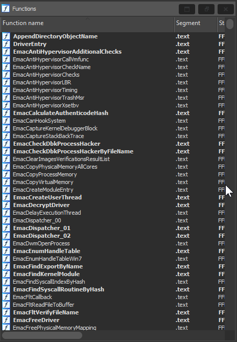

# EMACLAB (Gamersclub) Anticheat analysis

- __File Name__: EMAC-Driver-x64.sys
- __TimeDateStamp__: 0x67CAFFCE (Friday, 7 March 2025 14:16:46 GMT)
- __Protector__: VMProtect 3.8+

Full breakdown on my blog at: https://crvv.dev/emac-anticheat-analysis/

## Information

Approximately 200+ functions fully or partially reverse engineered, some of the functionality is completely unknown, obviously due to the fact code virtualization is used.

### Assets

- `assets\idb.7z` - The IDA database file (requires IDA 8.3+)
- `assets\Dumped_EMAC-Driver-x64.dll` - Live memory PE dump
- `assets\EMAC-Driver-x64.dll` - Original file

