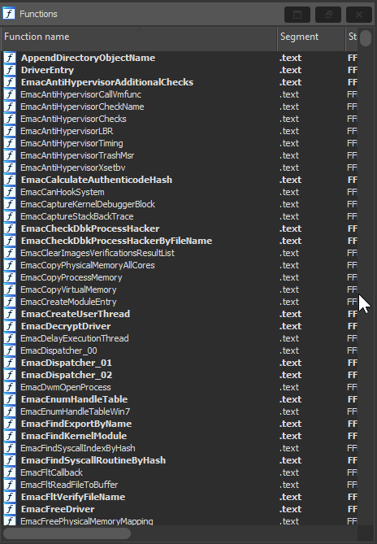

# EMACLAB (Gamersclub) Anticheat Analysis

> Comprehensive reverse engineering of the EMAC kernel-mode anti-cheat driver deployed for Counter-Strike 2 on the [GamersClub](https://gamersclub.com.br/) platform.

Article on my blog at: https://crvv.dev/emac-anticheat-analysis/

Full breakdown [EMAC Anticheat Analysis](EMAC-AntiCheat-Analysis.md)



## Target

| Property | Value |
|----------|-------|
| **File Name** | `EMAC-Driver-x64.sys` |
| **TimeDateStamp** | `0x67CAFFCE` (Friday, 7 March 2025 14:16:46 GMT) |
| **Platform** | Windows x64 Kernel Mode (WHQL-signed) |
| **Protector** | VMProtect 3.8+ (virtualization only — no packing due to WHQL requirements) |
| **Total Functions** | 931 (200+ named/reversed with `Emac` prefix) |
| **Pool Tag** | `EMAC` / `CAME` (`0x43414D45`) |
| **IOCTL Code** | `0x1996E494` |

## Scope

Approximately 200+ functions fully or partially reverse engineered. Some functionality remains unknown due to VMProtect code virtualization on critical dispatch paths (e.g. `EmacIoctlCommandRouter`, `EmacNmiCallback`).

### Detection systems identified

- **Anti-Hypervisor** — CPUID timing, LBR MSR probes, synthetic MSR writes, PCI vendor enumeration (VMware, VirtualBox, Hyper-V, QEMU, Parallels), XSETBV/VMFUNC exception probes
- **InfinityHook & Syscall Interception** — Hooks `HvlGetQpcBias` via magic stack markers (`0xEAADDEEAADDEADDE`), intercepts 14 syscalls (NtAllocateVirtualMemory, NtReadVirtualMemory, NtWriteVirtualMemory, NtCreateThreadEx, etc.)
- **Inline Hooks** — 7 kernel API hooks active under test-signing mode (KeAttachProcess, MmCopyVirtualMemory, MmGetSystemRoutineAddress, etc.)
- **Kernel Thread Stack Trace Verification** — Enumerates all system threads, captures kernel stacks, validates every return address belongs to a signed Microsoft module
- **NMI-Based Stack Scanning** — Fires NMIs to all CPUs to capture kernel stacks at arbitrary execution points (callback is VMProtect-virtualized)
- **Driver Self-Integrity** — Loads own driver from disk, XOR-decrypts, compares `.text`/`.idata` sections byte-by-byte against live memory
- **Syscall Integrity** — Monitors 8 critical Nt* syscalls for SSDT inline hooks
- **BigPool Scanning** — Queries `SystemBigPoolInformation`, detects manually-mapped drivers by counting ntoskrnl import references (threshold: 9–79)
- **Physical Memory & Page Table Walking** — Full PML4→PTE walking, detects RWX pages, scans physical memory for cheat patterns
- **Usermode Memory Scanning** — Suspicious import heuristic (>4 of 11 ntoskrnl APIs), aimbot float constant detection (>5 of 14 IEEE 754 values), MDL/DMA cheat detection
- **Driver/Module Blacklisting** — MmUnloadedDrivers (11 patterns including BlackBone, Process Hacker, Cheat Engine), PiDDBCache, PsLoadedModuleList PTE verification
- **Image Load Callback & DLL Injection** — Monitors all image loads, injects EMAC client DLLs via `NtCreateThreadEx` + `LoadLibraryW`
- **Minifilter** — Altitude 363570, validates PE signatures, checks against 14-entry certificate blacklist
- **Handle Protection** — `ObRegisterCallbacks` to strip `PROCESS_VM_READ`/`WRITE`/`OPERATION` from handles to protected processes
- **System Table Integrity** — Verifies `HalPrivateDispatchTable`, `gDxgkInterface`, `KdDebuggerDataBlock`
- **Hardware Fingerprinting** — TPM 2.0 queries, Secure Boot UEFI variable check, CLASSPNP dispatch hook for disk serial numbers, PCI device enumeration

### Obfuscation techniques identified

| Technique | Details |
|-----------|---------|
| XOR IAT | All imported API pointers XOR'd with runtime key (`qword_FFFFF801BCFACC40`) and guarded by opaque predicate |
| String Encryption | [JustasMasiulis/xorstr](https://github.com/JustasMasiulis/xorstr) with 3 SSE key pairs |
| FNV-1a Hashing | Custom variant (seed: `213573`, multiplier: `2438133`) for API/process name resolution |
| VMProtect Virtualization | Critical dispatchers, NMI callback, and syscall router are VM-enter protected |
| Dead Code | Opaque predicate (`qword_FFFFF801BCFACC38`, always true) generates unreachable branches |
| Embedded Disassembler | [bitdefender/bddisasm](https://github.com/bitdefender/bddisasm) for dynamic offset resolution |

## Repository Structure

```
├── README.md                            # This file
├── ida64_eZoazraO81.gif                 # IDA Pro analysis showcase
├── cb.c                                 # Callbacks (minifilter, image load, handle protection)
├── globals.c                            # Global resolution & symbol lookup
├── hooks.c                              # InfinityHook, syscall handlers, inline hooks
├── hv.c                                 # Anti-hypervisor detection checks
├── iat.c                                # Import table reconstruction & XOR IAT
├── integrity.c                          # Integrity checks (thread stacks, BigPool, self-verify)
└── assets/
    ├── idb.7z                           # IDA database (requires IDA 8.3+)
    ├── idb.zip                          # IDA database (zip format)
    ├── Dumped_EMAC-Driver-x64.sys       # Live memory PE dump
    └── EMAC-Driver-x64.sys              # Original driver file
    └── EMAC-Driver-x64.sys.i64          # IDA 64-bit database
```

### Source files

The `.c` files contain cleaned-up decompiled output from IDA Pro, organized by subsystem:

| File | Contents |
|------|----------|
| `iat.c` | `EmacFindKernelModule`, `EmacGetSystemRoutineAddress`, `InitializeImportTable` — XOR IAT decryption, PsLoadedModuleList walking, export resolution |
| `globals.c` | `EmacGetThreadStartAddressWorkItem`, version-dependent KTHREAD offset resolution, dynamic symbol lookup |
| `hv.c` | `EmacAntiHypervisorCheckName` (CPUID brand string), `EmacAntiHypervisorCallVmfunc`, single-step/page-fault handlers, timing attacks |
| `hooks.c` | `EmacInfinityHookHandler` (magic marker scan), `EmacInfinityHookSetup`, `EmacGetCpuClock` hook |
| `cb.c` | `EmacFltCallback` (minifilter), `EmacImageCallback`, `EmacObPostHandleOperation`, file verification |
| `integrity.c` | `EmacVerifyKernelThreadsStackTrace`, `EmacScanBigPool`, `EmacVerifyDriverIntegrity*`, NMI registration |

## Assets

| File | Description |
|------|-------------|
| `assets/Dumped_EMAC-Driver-x64.i64` | IDA Pro database (IDA Pro 9.1+) with 200+ named/typed functions, struct definitions, and enum types (requires IDA 8.3+) |
| `assets/Dumped_EMAC-Driver-x64.sys` | Live memory PE dump — VMProtect devirtualization stubs resolved, IAT reconstructed |
| `assets/EMAC-Driver-x64.sys` | Original untouched driver binary from GamersClub installation |


## Note

This analysis was done in March/2025 therefore we can consider most of this information is partially or totally wrong. Since then EMACLAB have improved its kernel driver significally and even changed the protection software to what i believe to be [CodeDefender](https://codedefender.io). 
Please use this for educational purposes only.
